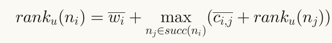
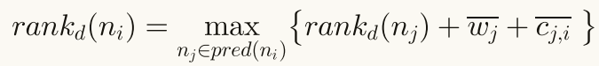
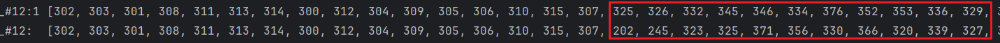
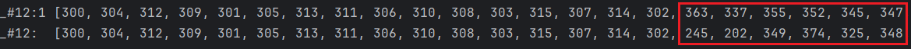

### 实验记录

##### 2025.4.7

* 集成了maxgraph，绘制工作流任务依赖关系图

##### 2025.4.8

* 集成了WorkflowGenerator，生成工作流xml文件

#### 2025.4.9

* 完善了控制台打印仿真结果信息的功能

#### 2025.4.12

* 实现了将工作流的执行结果以甘特图的形式展示的功能

#### 2025.4.15

* 修改代码，使得在执行planner之前，先将vm分配到主机

#### 2025.4.18

* 扩展了日志功能

#### 2025.4.19

* 完成了截止期划分的功能

#### 2025.4.21

* 基于json文件，创建指定配置的主机和虚拟机
  
#### 2025.4.25

* 实现了基于dvfs的任务调度功能

#### 2025.5.6

* 实现了基于变邻域下降的任务序列调整

#### 2025.5.8

* 修复bug，startTime < readyTime
* 解决电费计算错误问题

#### 2025.5.12

* 识别本地输入文件，并设置其所在主机

#### 2025.5.13

* 使用ByteBuddy在运行时修改CloudSim.clock()的返回值

#### 2025.5.14

* 实现了多工作流调度

#### 2025.5.16

* 实现了多broker工作流调度

#### 2025.5.17

* 对比实验

#### 2025.5.19

* 一般来说，sim的执行时间比pln的要更长
* 那个bug我解决不了
* 关于执行时间的问题，由于精度误差，导致运行时间不一致

#### 2025.5.20

* 今天发现，pln的执行时间居然没有误差，sim的执行时间仍然有误差，经常出现exec_time < process_time
* 对比不同工作流排序方法，对实验结果的影响

#### 2025.5.21

* 胜利，解决了之前的bug，爽

#### 2025.5.23

* actualCpuTime包含了文件传输时间和任务执行时间，cloudletLength被更新了

* 代码细节问题

```java
// 执行这行代码时，process_time 与 elec_cost都是正常的
send(getId(),estimatedProcessTime,CloudActionTags.VM_DATACENTER_EVENT);
```

```java
// 如果修改为下面这行代码，则process_time 则会有些偏大，elec_cost则正常。如下表所示
send(getId(),estimatedProcessTime +fileTransferTime,CloudActionTags.VM_DATACENTER_EVENT);
```

#### 2025.5.24

* 考虑任务执行期间的瞬态故障问题，并实现任务重试功能
* 不改了，cloudletLength包括了，file transfer length + length + retry length

#### 2025.5.25

* 修复了子截止期计算错误的问题
* 关于upward rank 与 downward rank 的区别，upward rank 包含任务本身的计算成本；downward rank 不包含任务本身的计算成本





#### 2025.5.27

* 实现了ECWSD算法

#### 2025.5.28

* 修复了些bug，ECWSD的变邻域下降算法不适用于Inspiral类型的工作流
* 代码优化问题
```java
if (solution.getFinishTime() <= workflow.getDeadline()) {
    if (bestSolution == null || solution.getElecCost() < bestSolution.getElecCost()) {
        bestSolution = solution;
        record = execWindowMapCopy;
        k = 0;
    } else {
        k++;
    }
}else{ // 对于这个else可去除或保留，若保留，只要不满足可行解的条件，则k++，这有利于算法快速退出，但可能错过后面潜在的可行解；若去除，并且当可行解的要求很严格时，则算法会因为找不到可行解陷入死循环，
    k++;
}
```
改进后的代码，之后发现改进后的代码仍然会陷入死循环，即当一直能找到可行解时，但没有找到更好的解时。
```java
if (solution.getFinishTime() <= workflow.getDeadline()) {
    infeasibleStreak = 0;
    if (bestSolution == null || solution.getElecCost() < bestSolution.getElecCost()) {
        bestSolution = solution;
        record = execWindowMapCopy;
        k = 0;
    } else {
        k++;
    }
} else { 
    infeasibleStreak++;
}
```
最终的代码
```java
boolean feasible = solution.getFinishTime() <= workflow.getDeadline();
boolean isBetter = bestSolution == null || solution.getElecCost() < bestSolution.getElecCost();
if (feasible && isBetter) {
    bestSolution = solution;
    record = execWindowMapCopy;
} else {
    k++;
}
```

#### 2025.5.29


* 当我尝试用下述序列作为调度序列时，虽然满足拓扑顺序，但在实际调度过程中，任务的提交顺序与调度序列仍然不一致，主要的原因可能在于，拓扑序列只考虑了任务之间的依赖关系，但并未考虑任务之间的数据传输时间和任务的执行时间
```java
List<Job> list = getExecWindowList().stream().sorted(Comparator.comparingDouble(ExecWindow::getStartTime)).map(ExecWindow::getJob).toList();
```
结果为，第一行是list的顺序，第二行是实际调度过程中的提交的顺序



* 当我尝试使用planner.getSequence作为调度序列时，虽然满足拓扑顺序，但任务提交顺序与调度序列也不一致，主要的原因可能在于，拓扑序列只考虑了任务之间的依赖关系，但并未考虑任务之间的数据传输时间和任务的执行时间


另外，好像实验结果也更具有一致性，目前只是猜测
```java
                                                  Demo14 Experiment Result
| idx  |                       Name                       |        Pln_Elec_Cost         |        Sim_Elec_Cost         |       Pln_Finish_Time        |       Sim_Finish_Time        |           Runtime            |
|  1   |          MyPlanner_JobNumComparator_asc          |          139.00 (1)          |          60.99 (1)           |         46443.53 (1)         |         48538.46 (1)         |          16.96 (0)           |
|  2   |        ECWSDPlanner_JobNumComparator_asc         |          44.44 (0)           |          38.49 (0)           |         42911.45 (0)         |         22568.70 (0)         |          22.41 (1)           |
```
* 测试MyPlanner的代码k是否需要重置为0
```java
if (feasible && isBetter) {
    bestSolution = solution;
    record = execWindowMapCopy;
//  k = 0; // 这行代码是否需要注释
} else {
    k++;
}
```
目前来说，当注释k=0之后（目前没有启动retry）


#### 2025.5.30

* 修复了est的bug
* 实现了DEWS算法

#### 2025.5.31

* 又发现了一个bug，关于在真正插入执行窗口时的readyTime的确定问题

#### 2025.6.1

* 找出了为什么plnElecCost与simElecCost不一致的原因（并不是指不相等），主要原因在于计算beginTime与ReadyTime的差异，做了一个实验当不涉及到数据传输时，transferElecCost仍不为零
```java
// 在执行这句代码之前，应该加一个判断，是否有前驱数据和本地数据的传输； 如果有，则需要加上传输的耗电成本
double transferElecCost = ExperimentUtil.calculateElecCost(elecPrice, beginTime, readyTime, bestFv.getPower());
```
```java
                                                Demo12 Experiment Result
| idx  |                       Name                       |        Pln_Elec_Cost         |        Sim_Elec_Cost         |       Pln_Finish_Time        |       Sim_Finish_Time        |           Runtime            |
|  1   |          MyPlanner_JobNumComparator_asc          |          50.01 (3)           |          50.01 (2)           |         35163.05 (2)         |         39828.80 (4)         |           8.16 (5)           |
|  2   |          MyPlanner_DepthComparator_asc           |          50.01 (2)           |          50.01 (3)           |         43511.42 (5)         |         43512.66 (5)         |           7.80 (4)           |
|  3   |      MyPlanner_CloudletLengthComparator_asc      |          49.61 (0)           |          49.61 (0)           |         33797.25 (0)         |         33024.25 (0)         |           7.40 (3)           |
|  4   |         MyPlanner_JobNumComparator_desc          |          50.11 (5)           |          50.11 (5)           |         36420.58 (3)         |         36417.38 (1)         |           7.08 (0)           |
|  5   |          MyPlanner_DepthComparator_desc          |          49.88 (1)           |          49.88 (1)           |         39426.55 (4)         |         39423.33 (2)         |           7.22 (1)           |
|  6   |     MyPlanner_CloudletLengthComparator_desc      |          50.01 (4)           |          50.01 (4)           |         34969.51 (1)         |         39651.51 (3)         |           7.23 (2)           |
```
* 实现了HEFT算法

#### 2025.6.3

* 实现了EPEE算法
* 解决了一个计算elecCost的bug

#### 2025.6.4

* 显示gantt图时，添加了鼠标事件，click时，显示任务详情
* 修复了小bug, 数据传输阶段不发生错误，timeSpan不完全是执行阶段
* 解决了cloudletLength的更新问题


#### 2025.6.5

* 封装了SimStarter 与 ExperimentStarter
* 修复了EPEE算法calculateIpp方法中的bug

#### 2025.6.6

* 减少了计算execTimeMap和reliabilityMap的时间和存储开销
* 优化代码，减少执行时间

