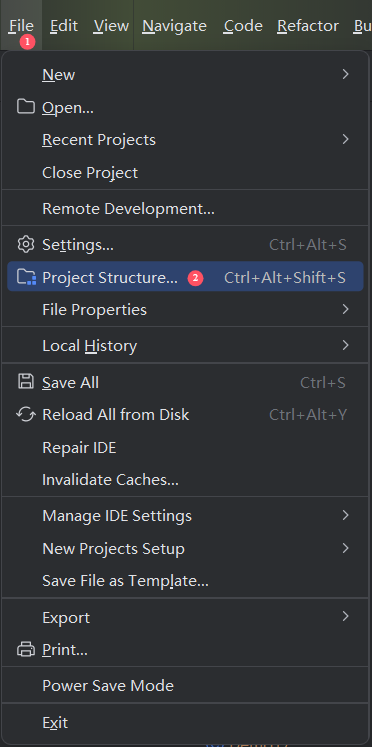
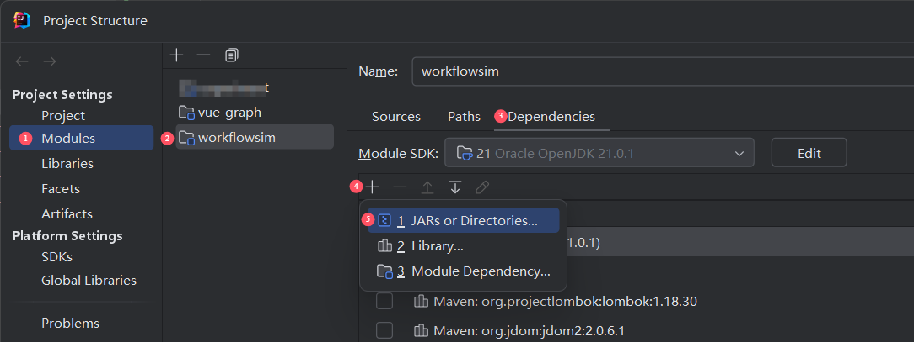
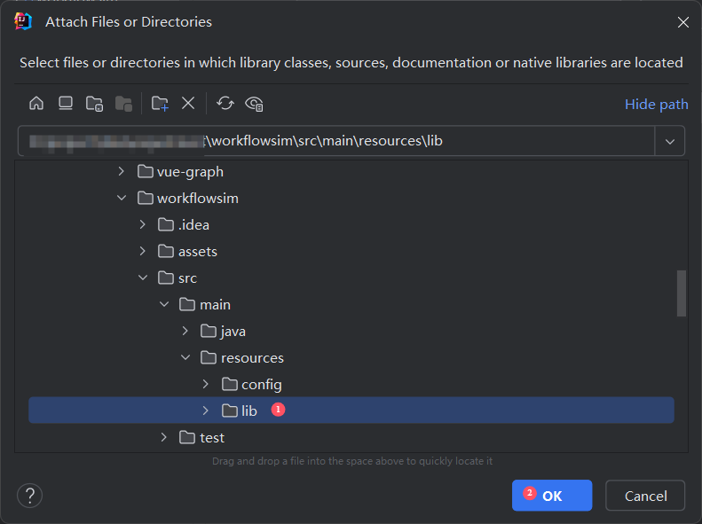
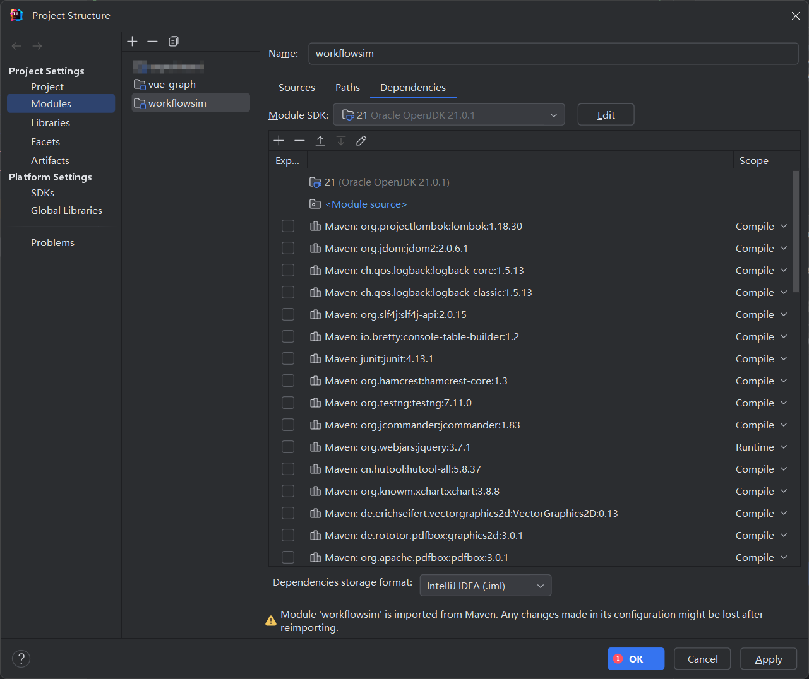

## Getting Started

`com.qiujie.example` is a demo package for demonstration purposes.

## Notice

You may encounter some problems when running the project for the first time, such as missing dependencies:

### Solution

1. In IntelliJ IDEA, go to the menu: **File -> Project Structure**.

2. Navigate to **Modules -> workflowsim -> Dependencies (JARs or Directories)**.

3. Select the `lib` directory, then click **OK**.

4. Finally, click **OK** to apply the changes.

